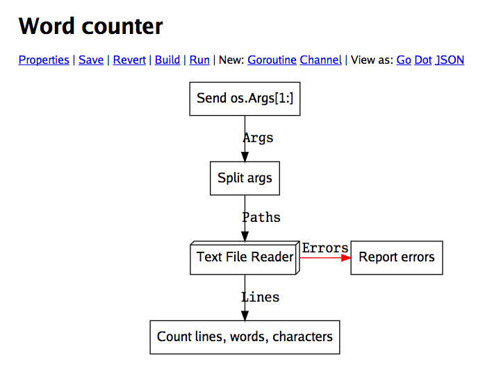

# "SHENZHEN GO" (working title)

 

SHENZHEN GO (working title) is an **experimental** visual Go environment, 
inspired by programming puzzle games such as TIS-100 and SHENZHEN I/O.

SHENZHEN GO provides a UI for editing a "graph," where the nodes are 
goroutines and the arrows are channel reads and writes. (This is analogous
to multiple "microcontrollers" communicating electrically in a circuit.)
It can also convert a graph into pure Go source code, which can be compiled 
and run, or used as a library in a regular Go program.

[SHENZHEN GO was unveiled](https://www.youtube.com/watch?v=AB9AUAmMlDo) at 
the [linux.conf.au 2017 Open Source & Games Miniconf](https://linux.conf.au/schedule/presentation/8/).

## Dependencies

SHENZHEN GO requires:

*   [Go 1.7+](https://golang.org/)
*   [Graphviz](http://graphviz.org/)
*   A web browser (e.g. [Chrome](https://www.google.com/chrome)).

## Installation

This assumes you have set your `$GOPATH` (common choices are `$HOME` and 
`$HOME/go`, but it's up to you).

To install, open a terminal and run:

    go get -u github.com/google/shenzhen-go/cmd/shenzhen-go

This should create the `shenzhen-go` binary in your `$GOPATH/bin` directory.
Run it:

    $GOPATH/bin/shenzhen-go

and a web browser should appear with SHENZHEN GO (if not, navigate to 
http://localhost:8088/ manually). 

The file browser is limited to the directory `shenzhen-go` was started in.

Navigate to the `examples/primes.szgo` file and play around - this demonstrates 
an example prime number sieve program.

## Notes

This is not an official Google product.

This is an experimental project - expect plenty of rough edges and bugs, and 
no support.

## More notes

*   SHENZHEN GO is a strictly one-way process. You *cannot* import Go code 
    that you wrote into SHENZHEN GO. 
*   You *can* write snippets of Go in your SHENZHEN GO graph, which then appear 
    in the Go output.
*   One day it should be possible to write zero Go code, yet produce wonderful 
    graphs that do useful things.
*   You can always save a copy of your program as Go, continue working on that, 
    and never touch SHENZHEN GO again. 
*   However, modifications to the generated output won't be preserved if 
    SHENZHEN GO builds or runs the design again.
*   Don't treat the Go output as a virtuous paragon of how to code in Go. It is
    "machine-generated" and therefore held to a lower standard than "hand-made".
*   The JSON-based file format aims to be *diffable*, or at least *not ugly*, 
    for the benefit of source control and code review.
